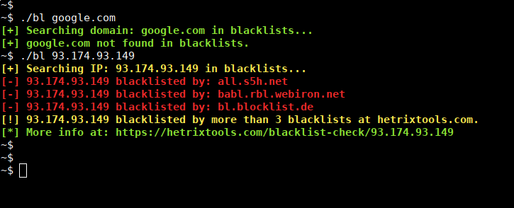

# blacklist-check-unix-linux-utility
Blacklist check UNIX/Linux utility. Some changes made to original code, in order to met some needs.

### Introduction

Check blacklisting for domains and IP addresses in shell.

Works on UNIX/Linux systems with Bash.

Blacklists grabbed from www.hetrixtools.com, you can get a more complete blacklist from: http://multirbl.valli.org/list/

### Installation
    $ git clone https://github.com/ksaver/blacklist-check-unix-linux-utility
    $ cd blacklist-check-unix-linux-utility
    $ chmod +x bl

### Usage

	# Use with domains or IP addresses
	$ ./bl domain.tld
	$ ./bl 8.8.8.8
    
	# Pipe with other UNIX utils, eg. grep. Only blacklisted:
	$ ./bl domain.tld | grep "blacklisted"

The script needs the file "blists.txt" in the current directory. You can edit the path in code file.

### Sample output

	~$ ./bl google.com
	[+] Searching domain: google.com in blacklists...
	[+] google.com not found in blacklists.
	~$ ./bl 93.174.93.149 
	[+] Searching IP: 93.174.93.149 in blacklists...
	[-] 93.174.93.149 blacklisted by: all.s5h.net
	[-] 93.174.93.149 blacklisted by: babl.rbl.webiron.net
	[-] 93.174.93.149 blacklisted by: bl.blocklist.de
	[!] 93.174.93.149 blacklisted by more than 3 blacklists at hetrixtools.com.
	[*] More info at: https://hetrixtools.com/blacklist-check/93.174.93.149
	 ...
